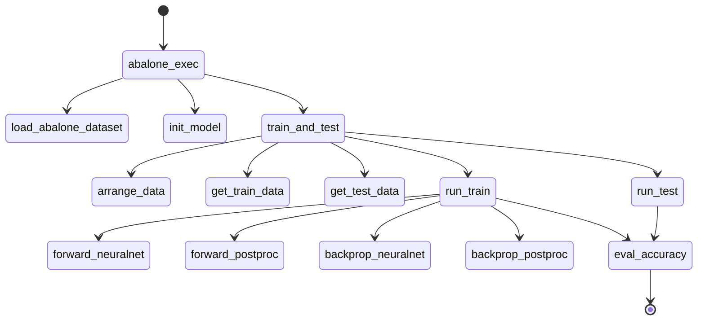

# Appendix

## Neuralnet Architecture

생략

## Flowchart

```flow
start=>start: 시작
load_data=>operation: 데이터불러오기
init_model=>operation: 가중치초기화
set_batch=>operation: 배치크기설정
shuffle=>operation: 데이터섞기
get_test_data=>operation: 테스트데이터분리

get_train_batch=>operation: 학습배치추출
foward_nn=>operation: 순전파(출력값)
foward_postproc=>operation: 순전파후처리(loss)
backprop_postproc=>operation: 역전파후처리(G_loss)
backprop_nn=>operation: 역전파(가중치업데이트)

is_max_epoch=>condition: 마지막에포크?
is_max_step=>condition:  마지막배치?

end=>end: 끝

start->load_data->init_model->set_batch->shuffle->get_test_data->get_train_batch->foward_nn->foward_postproc->backprop_postproc->backprop_nn->is_max_step

is_max_step(yes)->is_max_epoch
is_max_step(no)->get_train_batch

is_max_epoch(yes)->end
is_max_epoch(no)->shuffle
```


## Parameter Dimensions

* data
  * Features(X): 10
  * Y: 1

* Hyper parameters
  * Batch size : 20
  * Learning rate: 0.001

| 파라메터 | 차원     | 설명              | 비고                     |
| -------- | -------- | ----------------- | ------------------------ |
| X        | (20, 10) | 입력              | (batch_size, n_features) |
| W        | (10, 1)  | 가중치            | (n_features, n_output)   |
| B        | (1, 1)   | 편향              | -                        |
| OUT_Y    | (20, 1)  | 출력              | (batch_size, n_output)   |
| Y        | (20, 1)  | 실제 정답         | (batch_size, n_y)        |
| DIFF     | (20, 1)  | abs(OUT_Y - Y)    | (batch_size, n_y)        |
| SQUARE   | (20, 1)  | (DIFF)^2          | (batch_size, n_y)        |
| MEAN     | (1, 1)   | mean(SQUARE)      | -                        |
| LOSS     | (1, 1)   | Mean Square Error | -                        |

## Call graph




