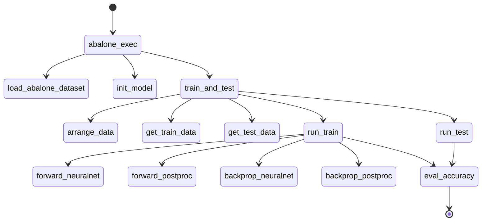

# Function details

## Call graph

## Function list

* abalone_exec
* load_ablaone_dataset
* init_model
* train_and_test
* arrage_data
* get_train_data
* get_test_data
* run_train
* run_test
* forward_neuralnet
* forward_postproc
* eval_accuracy
* backprop_neuralnet
* backprop_postproc

