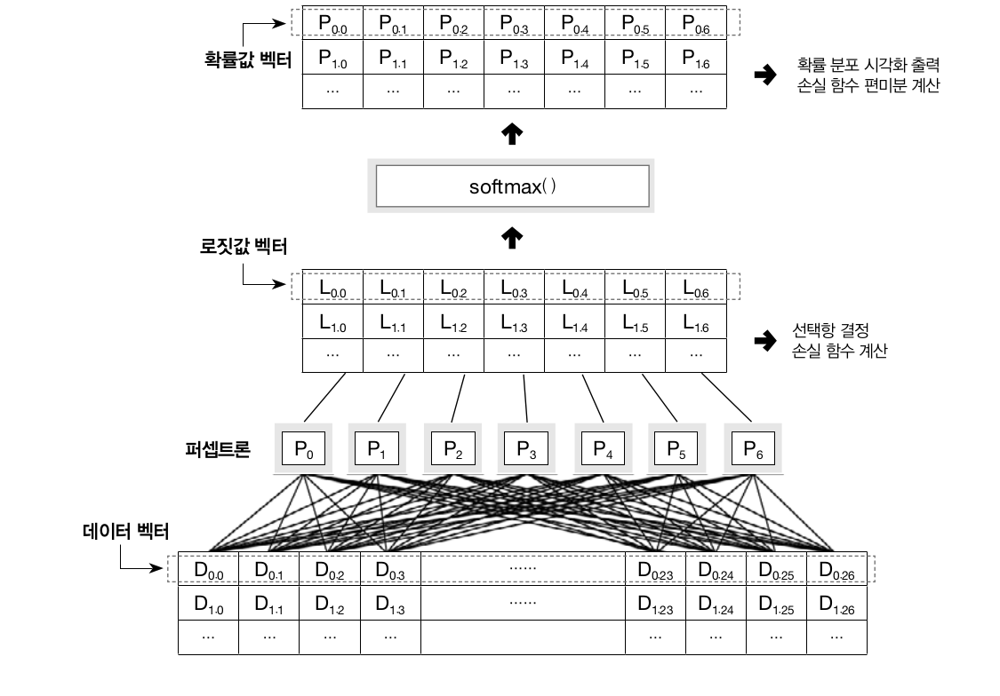
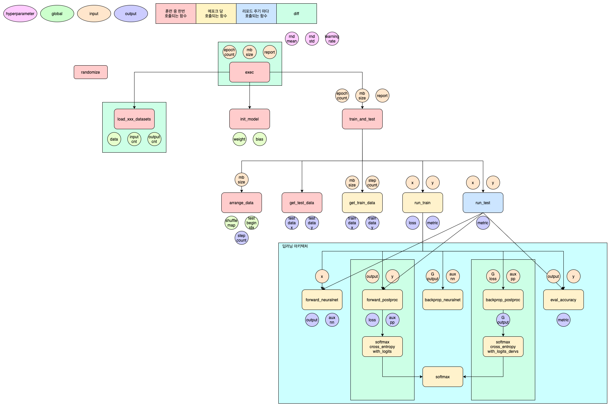
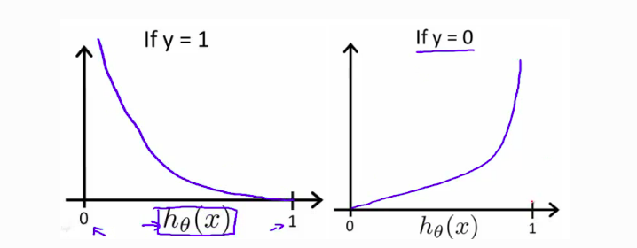

# 3. 불량 철판 판별

## INDEX

[1. 문제 개요](#1. 불량 철판 판별 문제 소개)

[2.선택 분류 신경망 처리](#2. 선택 분류 신경망 처리)

[3. 소프트맥스, 소프트맥스 교차엔트로피](#3. 소프트맥스, 소프트맥스 교차 엔트로피)

[4.시그모이드, 소프트맥스간 관계](#4. 시그모이드, 소프트맥스 관계)

[5.구현](#5. 불량 철판 판별 신경망 구현과 실행)

[6. 기타 질문](#6. 기타)

- 확률, 오즈, 로짓, 시그모이드, 소프트맥스 간 관계

- 분류 문제에서 로짓을 사용하는 이유(신경망 분류 문제의 가정)
- 분류문제에서 손실함수로 교차 엔트로피를 사용해야하는 이유(MSE 는 안되나?)
  - 걍 써도 되는데(팩트), 성능차이가 있다(혀노가설)
  - 교차 엔트로피의 목표는 확률분포 추정(팩트), 궁합이 맞다(혀노가설)

[A.용어](#A. 용어)

[references](#references)

## 1. 불량 철판 판별 문제 소개

###  Data

* 데이터 수: 1941개
* 변수: 27개
* 타겟: 7개

### Target

| 타겟명       | COUNT    | PERC    |
| ------------ | -------- | ------- |
| Pastry       | 158.0    | 8.14    |
| Z_Scratch    | 190.0    | 9.79    |
| K_Scatch     | 391.0    | 20.14   |
| Stains       | 72.0     | 3.71    |
| Dirtiness    | 55.0     | 2.83    |
| Bumps        | 402.0    | 20.71   |
| Other_Faults | 673.0    | 34.67   |
| **SUM**      | **1941** | **100** |

*Dortiness, Strains의 타겟비율은 2~4%로 검출이 어려울 것으로 보임*

*Other_Faults* Feature 균질성에 따라 성능 차이 상이할 것으로 보임

## 2. 선택 분류 신경망 처리

* 선택 분류 문제의 가정
  * 신경망을 통한 출력값은 **로짓**이다
* 선택 분류 학습과정
  1. **로짓** 출력
  2. 로짓을 **예측 확률**로 변환(**시그모이드**, **소프트맥스**)
  3. 예측 확률과 실제 확률간 **교차 엔트로피** 산출
  4. 교차 엔트로피, 실제 엔트로피(**손실함수**)를 통해 **손실함수 값** 산출
  5. 손실함수를 기반으로 **가중치**, **편향** 업데이트

<선택 분류 문제 중 소프트맥스 함수 활용 단계>

## 3. 소프트맥스, 소프트맥스 교차 엔트로피

### 소프트맥스(Softmax)

* 타겟 클래스별 예측 로짓을 예측 확률로 변환

* **특정 타겟 클래스에 대한 로짓의 전체비**

  * n개 타겟 클래스 중 i번째 타겟의 확률

  * $$
    p_i = \alpha \exp x_i \\
    p_1 + p_2 + ... p_n = \alpha(\exp x_1 + \exp x_2 + .. \exp x_n) = 1\\
    \alpha = \frac{1}{\exp x_1 + \exp x_2 + ... \exp x_n} \\ 
    \therefore p_i = \frac{\exp x_i}{\exp x_1 + \exp x_2 + ... \exp x_n}\\
    $$

  * $$
    [x_1, x_2, ... x_n] \Rightarrow softmax \Rightarrow [\frac{\exp x_1}{\exp x_1 + \exp x_2 + ... \exp x_n}, \frac{\exp x_2}{\exp x_1 + \exp x_2 + ... \exp x_n}\\, .. 
    \frac{\exp x_n}{\exp x_1 + \exp x_2 + ... \exp x_n}\\]
    $$

* 오버플로우
  * 로짓이 너무 커지면 지수함수 계산에서 overflow 발생 가능
  * 모든 로짓에서 로짓의 최댓값을 빼서 조정

### 소프트맥스 편미분

* 로짓 벡터(X) 와 예측 확률 벡터(Y)간 모든 순서쌍(X, Y) 에 대해 적용
* 로짓 벡터 길이(N), 확률 벡터 길이(N), 미니배치 길이(M) 를 고려하면 소프트맥스 편미분 행렬은 (N, N, M) 모양

$$
\begin{equation}
 \begin{cases}
 \frac{\partial y_i}{\partial xj} =-y_iy_j, & i \neq  j \\
 \frac{\partial y_i}{\partial xj} = y_i - y_i^2, & i \neq  j \\
 \end{cases}
 \end{equation}
$$

### 소프트맥스 교차 엔트로피 편미분

* 예측 확률 벡터(Y) 와 실제 확률 벡터(A) 간 교차 엔트로피

  * $$
    H(A, Y) = -\Sigma a_i\log{}{y_i}
    $$

  * 실제로 A 는 0과 1로만 구성돼있기 때문에 log 연산을 피하는 방식으로 구성

* x 에 대한 H(A, Y)의 편미분

  * $$
    \frac{\partial H}{\partial x_i} = y_i - a_i
    $$

## 4. 시그모이드, 소프트맥스 관계

* 이진분류 문제에서 로짓은 0을 기준으로 계산

* 시그모이드는 타겟클래스 수 가 1인 소프트맥스 함수와 같음

  * $$
    p = \frac{\exp x_i}{\Sigma_1^n\exp xj} =\frac{\exp{x}}{exp(0) + \exp x} = \frac{1}{1 + \exp(-x)}
    $$

## 5. 불량 철판 판별 신경망 구현과 실행

### 변수 차원 정의

| NO   | 변수                  | 변수명 | 모양         | 차원 | 비고                                 |
| ---- | --------------------- | ------ | ------------ | ---- | ------------------------------------ |
| 1    | 입력                  | X      | (10, 27)     | 2    | (BATCH_SIZE, N_FEATURES)             |
| 2    | 가중치                | W      | (27, 7)      | 2    | (N_FEATURES, N_OUTPUTS)              |
| 3    | 편향                  | B      | (1)          | 1    |                                      |
| 4    | 출력_로짓             | L      | (10, 7)      | 2    | (BATCH_SIZE, N_OUTPUTS)              |
| 5    | 출력_소프트맥스       | P      | (10, 7)      | 2    | (BATCH_SIZE, N_OUTPUTS)              |
| 6    | 소프트맥스_편미분     | SD     | (10, 27, 27) | 3    | (BATCH_SIZE, N_FEATURES, N_FEATURES) |
| 7    | 크로스엔트로피        | CE     | (10, 1)      | 2    | (BATCH_SIZE, 1)                      |
| 8    | 크로스엔트로피_편미분 | CED    | (10, 27)     | 2    | (BATCH_SIZE, N_FEATURES)             |

### 함수호출도




### 구현


$$
X \overset{W,B}{\to} Logit \overset{softmax}{\to} P_{pred} \overset {cross-entropy} {\to} Loss
$$


* 필요한 함수

  1. softmax

  ```python
  def softmax(x):
      max_elem = np.max(x, axis=1)
      diff = (x.transpose() - max_elem).transpose()
      exp = np.exp(diff)
      sum_exp = np.sum(exp, axis=1)
      probs = (exp.transpose() / sum_exp).transpose()
      return probs
  ```

  2. softmax_derv

  ```python
  def softmax_derv(x, y):
      mb_size, nom_size = x.shape
      derv = np.ndarray([mb_size, nom_size, nom_size])
      for n in range(mb_size):
          for i in range(nom_size):
              for j in range(nom_size):
                  derv[n, i, j] = -y[n,i] * y[n,j]
              derv[n, i, i] += y[n,i]
      return derv
  ```

  3. cross_entropy

  ```python
  def softmax_cross_entropy_with_logits(labels, logits):
      probs = softmax(logits)
      return -np.sum(labels * np.log(probs+1.0e-10), axis=1)
  ```

  4. cross_entropy_derv

  ```python
  def softmax_cross_entropy_with_logits_derv(labels, logits):
      return softmax(logits) - labels
  ```

## 6. 기타

### 분류 문제에서 로짓을 써야하는 이유

입력 -> **w, b** (선형 연산, + X) -> 출력( 범위를 지정할 수 없다)   |  확률(정답)

퍼셉트론은 선형연산을 수행해 [-inf, inf] 범위의 값을 출력한다. 이를 0 ~ 1 범위의 확률과 비교하려면 **1) 범위를 한정할 수 없으며 2) 확률과 관련있는 수치가 필요하다. ** 따라서 분류문제에서는 퍼셉트론의 출력값을 로짓(확률간의 로그비)로 가정하고, 이를 출력함수(시그모이드, 소프트맥스)를 통해 확률로 변환한다. (뇌피셜)

### 확률, 오즈, 로짓, 시그모이드, 소프트맥스 간 관계


< 확률, 오즈, 로짓, 시그모이드, 소프트맥스 간 관계>

### 손실함수를 왜 교차 엔트로피로 하는가

교차엔트로피는 오탐값에 대한 패널티가 크며 단조증가한다.
$$
H(A, Y) = -\Sigma a_i\log{}{y_i}
$$




* 원핫엔코딩된 분류문제에서는 실제 라벨이 1인 값에 대해서만 패널티가 적용됨

$$
a = [1, 0, 0] \\

p_{1} = [0.1, 0.7, 0.2] \\

==>

p_{2} = [0.1, 0.2, 0.7] \\

CE = -1\log{}{0.1} - 0\log{0.8} - 0\log{0.9} = -\log{}{0.1} \\
$$

* 아래 식으로 해야 0 인값에 대해서도 패널티 적용
  $$
  CE_2 =  - a\log{}{P_{pred}} + (1-a)\log(1-P_{pred})
  $$


$$
H(A, Y) = -\Sigma a_i\log{}{y_i}
$$

$$
a_1 = a \\
a_2 = 1-a \\
p_1 = p_{pred} \\
p_2 = 1 - p_{pred} \\

CE_1 = -\sum a_i \operatorname{log} p_i = - (a \operatorname{log}p_{pred} + (1-a)\operatorname{log}(1-p_{pred}))
$$

* 이진 분류에서 p1, p2 를 각각 1, 0 이 될 확률로 지정하면 이진분류 교차 엔트로피도 다항 교차 엔트로피 식으로 표현할 수 있음


$$
p_1 = 1 - p_o \\
- H(A, Y) = -\Sigma a_i\log{}{y_i} = -(a_1 log p_{1} + (1 - a_1)log(1-p_{1}))
$$

## A. 용어

* **오즈(Odds)**

  * 실패 확률에 대한 성공 확률의 비 

    * $$
      odds = \frac{P(y=1|x)}{1-P(y=1|x)}
      $$

  * 확률이 예측값이 0.5보다 크면 성공으로 분류 == 오즈가 1보다 크면 성공으로 분류

* **로짓(Logit)**

  * 오즈에 로그를 취한 값

    * $$
      Logit = log(odds) = log(\frac{P(y=1|x)}{1-P(y=1|x)})
      $$

  * 오즈가 1보다 크면 성공으로 분류 == 로짓이 0보다 크면 성공으로 분류

* **시그모이드(Sigmoid)**

  * 로짓을 확률로 변환하는 함수(로짓의 역함수)

  * $$
    \sigma(x) = \frac{1}{1+\exp(-x)}
    $$

* **소프트맥스(Softmax)**

  * 선택 분류 문제에서의 시그모이드 함수

    * $$
      p_i = \frac{\exp x_i}{\Sigma_1^n\exp xj}
      $$

    * n = 1, 로짓 0에 비해 몇배 큰가?

      * $$
        p = \frac{\exp{x}}{exp(0) + \exp x} = \frac{1}{1 + \exp(-x)}
        $$

* **엔트로피(Entropy)**

  * 확률분포 P를 표현하기 위한 정보량의 기댓값

    * $$
      H = - \Sigma p_ilog_{}{p_i}
      $$

* **교차 엔트로피(Cross Entropy)**

  * 확률분포 Q를 따르는 사건이 확률분포 P로 발생할 때의 엔트로피

    * $$
      H(P, Q) = -\Sigma p_ilog_{}{q_i}
      $$

    * $$
      H(P, Q) >= H(P, P)
      $$

## references

* [오픈튜토리얼](https://opentutorials.org/module/3653/22995)
* [ML Glossary](https://ml-cheatsheet.readthedocs.io/en/latest/logistic_regression.html)
* [블로그](https://worthpreading.tistory.com/23)

