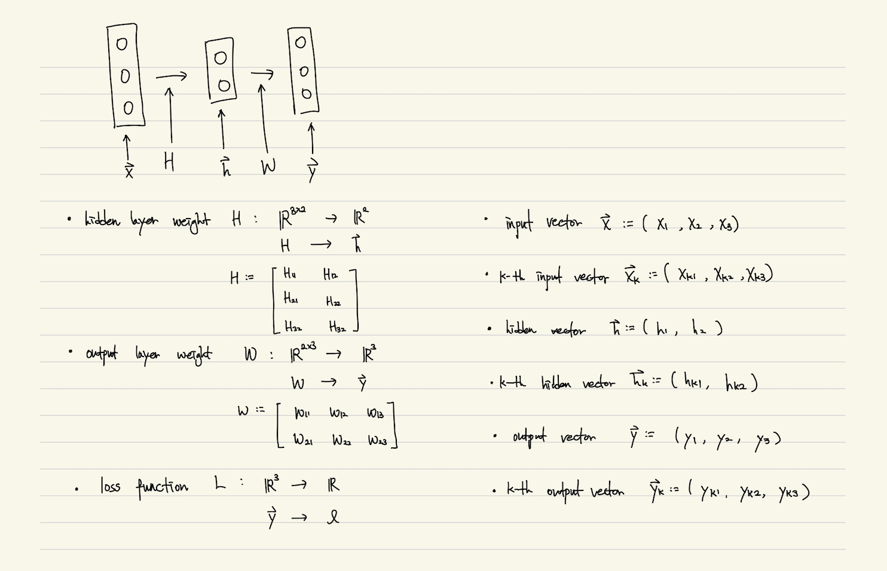
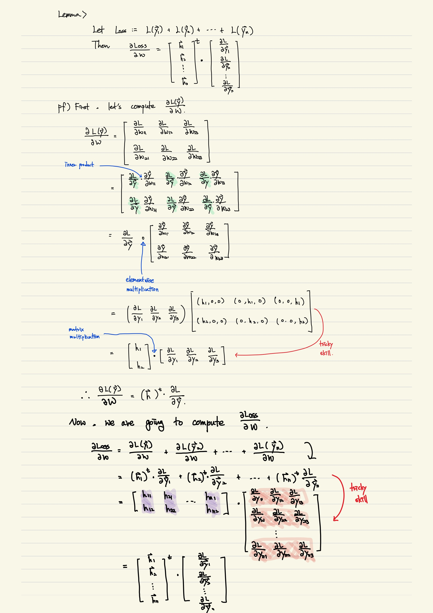
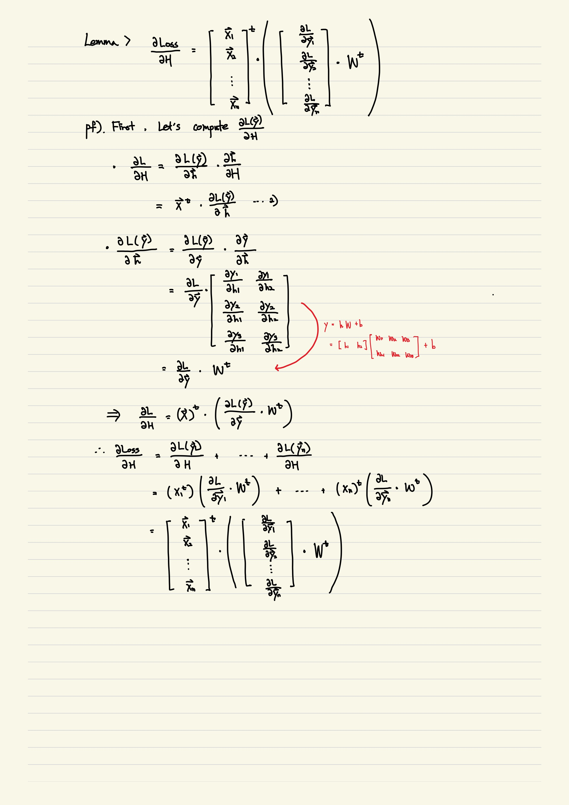

# 다층 퍼셉트론 기본 구조 : 세 가지 신경망의 재구성

[TOC]

part: 다층 퍼셉트론(MLP)

**학습 목표**

- 다층 퍼셉트론 신경망 구조와 은닉 계층
- 비선형 활성화 함수와 ReLU 함수
- 민스키의 XOR 문제와 비선형 활성화 함수의 필요성
- 다층 퍼셉트론 신경망을 지원하는 함수 구현
- 1부에서 다루었던 세 문제를 다층 퍼셉트론으로 풀어보기

[TOC]

## 다층 퍼셉트론 신경망 구조

다층 퍼셉트론 신경망은 은닉 계층과 출력 계층으로 구분된다. 출력 계층은 신경망에 주어진 원래의 임무에 따라 알맞은 형태의 출력 벡터를 생성하는 역할을 맡는다. 하지만 은닉 계층은 이러한 제약이 없다. 따라서 은닉 계층의 수와 은닉 계층의 폭은 신경망 설계자가 자유롭게 정할 수 있다.

은닉 계층 폭이란 [해당 계층이 갖는 퍼셉트론의 수]이자 [생성하는 은닉 벡터의 크기]이다. 또한 퍼셉트론을 노드라고도 한다.

은닉 계층의 수와 각 은닉 계층의 폭은 신경망의 품질을 경정짓는 중요한 요인이 될 수 있지만 은닉 계층 수와 폭은 문제의 규모, 데이터양, 난이도를 종합적으로 고려하여 설정해야 한다. 이를 위해 다양한 실험과 축적된 경험이 중요하며, 따라서 다층 퍼셉트론을 도입할 때는 은닉 계층 수와 폭 설정값을 쉽게 바꾸어가며 실험할 수 있게 프로그램을 구현해야 한다.

다양한 실험에 따르면 노드 수가 많은 단층 구조 신경망보다 노드 수가 적은 다층 구조 신경망 성능이 훨씬 우수한 경우가 많다. 이는 입력 데이터로부터 유용한 정보를 추출해내는 추상화에 단층 구조보다 다층 구조가 효과적이기 때문으로 보인다.

비선형 활성화 함수를 갖춘 은닉 계층을 충분한 수의 퍼셉트론으로 구성하고 가중치와 편향값만 잘 설정해주면 단 두 계층의 다층 퍼셉트론 구조만으로 어떤 수학적 함수이든 원하는 오차 수준 이내로 근사하게 동작하도록 만들 수 있음이 수학적으로 증명되었다고 한다. 하지만 부족하기 일쑤인 데이터로 자칫 지나치게 커지기 쉬운 신경망을 어떻게 학습시켜 적절한 파라미터 조합을 찾는다는 것은 다른 문제이다. CNN이나 RNN과 같이 고급 구조들이 등장한 이유도 이런 문제 때문이다.

## ReLU 함수

ReLu 함수는 음수 입력을 걸러내 0으로 만드는 간단한 기능을 제공하는 함수이다. 이 함수는 꺽인 선 모양이며, 당연히 비선형 함수로 분류된다.

시그모이드나 소프트맥스도 비선형 함수이지만 지수 연산이 포함된 계산 때문에 처리 부담이 있다. 다층 퍼셉트론에서 은닉 계층에 비선형 특성을 추가할 때는 쉽고 빠르게 계산할 수 있는 ReLU 함수를 주로 이용한다.

## Backpropagation

은닉 계층이 하나인 다층 퍼셉트론을 위한 역전파 함수를 정의해보자.

```python
def backprop_neuralnet_hidden1(G_output, aux):
    global pm_output, pm_hidden
    x, hidden = aux
    
    # 출력층 그래디언트
    g_output_w_out = hidden.transpose()
    G_w_out = np.matmul(g_output_w_out, G_output)
    G_b_out = np.sum(G_output, axis=0)
    
    # 은닉층 그래디언트를 구하기위해 출력층 가중치들을 저장
    g_output_hidden = pm_output['w'].transpose()
    G_hidden = np.matmul(G_output, g_output_hidden)
    
    # 출력층 가중치 업데이트
    pm_output['w'] -= _learning_rate * G_w_out
    pm_output['b'] -= _learning_rate * G_b_out
    
    # 은닉 계층 그래디언트
    G_hidden = G_hidden * relu_derv(hidden)
    g_hidden_w_hid = x.transpose()
    G_w_hid = np.matmul(g_hidden_w_hid, G_hidden)
    G_b_hid = np.sum(G_hidden, axis=0)
    
    # 은닉 계층 가중치 업데이트
    pm_hidden['w'] -= _learning_rate * G_w_hid
    pm_hidden['b'] -= _learning_rate * G_b_hid
```

이 코드를 분석하기 위해 실제로 미분이 어떻게 되는지 알아보자.

### Matrix dervative, $\frac{\partial Loss}{\partial W}$ & $\frac{\partial Loss}{\partial H}$

문제를 간소화하기 위해 다음과 같은 제약 조건을 세팅한다.

```
input_cnt = 3
hidden_cnt = 2
output_cnt = 3
mb_size = n
```

#### Notation



#### Loss를 W로 미분



#### Loss를 H로 미분



### Backpropagation

위에 정보를 토대로 `backprop_neuralnet_hidden1`코드를 다시 살펴보자

```python
def backprop_neuralnet_hidden1(G_output, aux):
    global pm_output, pm_hidden
    x, hidden = aux
    
    # ---------------------------------------------------------------
    # 출력층 그래디언트
    g_output_w_out = hidden.transpose()
    G_w_out = np.matmul(g_output_w_out, G_output)
    G_b_out = np.sum(G_output, axis=0)
    # ---------------------------------------------------------------
    
    # ---------------------------------------------------------------
    # 은닉층 그래디언트를 구하기위해 출력층 가중치들을 저장
    g_output_hidden = pm_output['w'].transpose()
    G_hidden = np.matmul(G_output, g_output_hidden)
    # ---------------------------------------------------------------
    
    # 출력층 가중치 업데이트
    pm_output['w'] -= _learning_rate * G_w_out
    pm_output['b'] -= _learning_rate * G_b_out
    
    # ---------------------------------------------------------------
    # 은닉 계층 그래디언트
    G_hidden = G_hidden * relu_derv(hidden)
    g_hidden_w_hid = x.transpose()
    G_w_hid = np.matmul(g_hidden_w_hid, G_hidden)
    G_b_hid = np.sum(G_hidden, axis=0)
    # ---------------------------------------------------------------
    
    
    # 은닉 계층 가중치 업데이트
    pm_hidden['w'] -= _learning_rate * G_w_hid
    pm_hidden['b'] -= _learning_rate * G_b_hid
```


