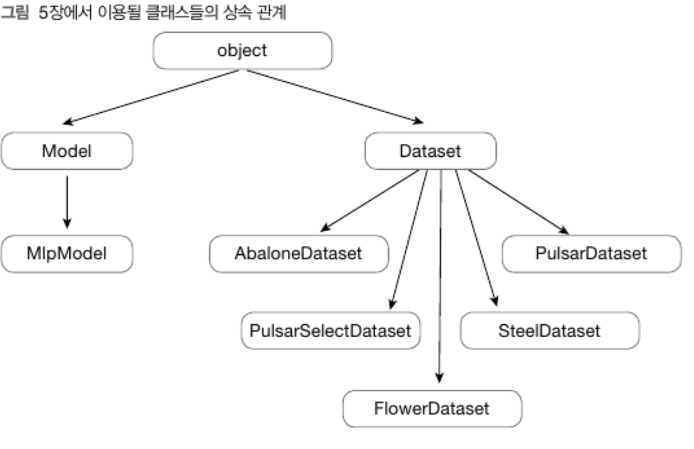
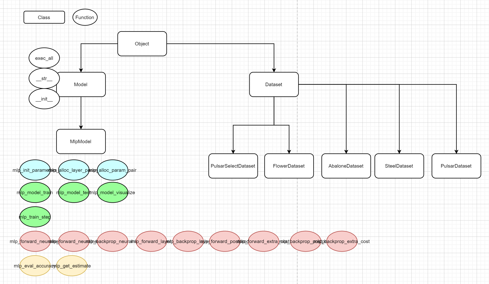

# 다층 퍼셉트론 모델 구조

## 목표

- 파이썬 클래스에 대한 이해
- 다층 퍼셉트론 구조를 지원하는 클래스 설계
- 학습, 검증, 평가 단계에 사용할 데이터셋 분할

## 데이터 분할 : 학습, 검증, 평가

일반적으로 데이터는 학습 재료가 되는 훈련(학습)데이터, 학습 과정에서 중간 점검에 이용되는 검증 데이터, 학습 후에 학습 품질을 확인하는데 이용되는 평가 데이터로 나눈다.

- 학습 데이터(Training)
- 검증 데이터(Validation)
- 평가 데이터(Test)

그런데 딥러닝 모델에서 중요한 것은 학습 과정에서의 성적보다 실전에서의 성적이다. 따라서 학습 데이터도 중요하지만 검증 데이터나 평가데이터를 잘 활용해 학습 결과를 검증하고 평가하여 실전에 알맞은 모습으로 학습되고 있는지를 점검하는 과정도 중요하다. 이 때문에 세 가지 데이터는 서로 겹치지 않으면서 골고루 섞이게 준비하는 것이 중요하다.

## 클래스

> **객체지향 프로그래밍**은 변수와 알고리즘을 객체별로 모아 정리해서 프로그램의 **가독성**과 **확장성**을 높이는 발전된 프로그래밍 기법이다. 객체지향에 대해 좀 더 자세한 내용을 알고싶다면 [이곳](https://github.com/JaeYeopHan/Interview_Question_for_Beginner/tree/master/Development_common_sense)을 참고하도록 한다.

클래스는 지금까지 공부한 함수나 자료형처럼 프로그램 작성을 위해 꼭 필요한 요소는 아니다. 하지만 프로그램을 작성할 때 클래스를 적재적소에 사용하면 프로그래머가 얻을 수 있는 이익은 상당하다. 여기서 간단하게 코드를 작성하는데 사용되는 클래스의 개념에 대해서 알아보도록 한다.

### 생성자 (Constructor)

생성자(Constructor)란 객체가 생성될 때 자동으로 호출되는 메서드를 의미한다.

파이썬 메서드 이름으로 `__init__`를 사용하면 이 메서드는 생성자가 된다. 객체가 생성되는 시점에 자동으로 호출된다.

```python
class Model(object):
    def __init__(self, name, dataset):
        self.name = name
		...
m = Model('abalone_model', ad) # 객체 생성으로 생성자 호출
```

### 클래스의 상속

어떤 클래스를 만들 때 다른 클래스의 기능을 물려받을 수 있게 만드는 것이다.

클래스를 상속하기 위해서는 다음처럼 클래스 이름 뒤 괄호 안에 상속할 클래스 이름을 넣어주면 된다.

- class 클래스 이름(상속할 클래스 이름)

```python
class Model(object):
    def __init__(self, name, dataset):
		...
    
    def __str__(self):
        return f'{self.name}/{self.dataset}'
    
    def exec_all(self, ...):
        ...

class MlpModel(Model):
    def __init__(self, name, dataset, hconfigs):
        super(MlpModel, self).__init__(name, dataset)
        ...
```

MlpModel 클래스는 Model 클래스를 상속했으므로 Model 클래스의 모든 기능을 사용할 수 있다.

#### `super()`,` __str__`

`super()`는 부모 클래스인 Model 클래스를 찾아 객체 초기화 함수를 호출하여 name과 dataset값을 저장하는 용도로 사용된다.

`__str__()` 메서드 역시 파이썬이 미리 예약된 이름의 메서드다. 출력문으로 객체를 출력할 때의 출력 문자열 생성 방법을 정의한다.

### Property

`@property`를 사용하는 목적에는

1. 변수를 변경 할 때 어떠한 제한을 두고 싶어서
2. get,set 함수를 만들지 않고 더 간단하게 접근하게 하기 위해서
3. 하위호환성에 도움이 됨

등등이 있다.

c++이나 java처럼 클래스에서 private, protected 키워드의 역할을 파이썬에서는 `_, __`로 대신한다. 그리고 getter나 setter 메서드를 `@property`와 `@변수명setter`로 대신하게 된다. 다만 파이썬에서는 저렇게 키워드 설정을 했다고 해도 클래스 외부에서 절대로 접근할 수 없어지는게 아니다. 즉, 강제되는 사항이 아니고 필요하다면 사용하는 기능이다. 외부에서 `_, __`로 접근하면 여전히 사용가능하다. 

다만 이 책에서는 함수 메서드이면서도 함수가 아닌 속성으로 취급되어 `a.train_count()` 형식 대신 인수 구조 없이 `a.train_count`와 같은 형식으로 접근할 목적으로 사용되었다.

```python
class Dataset(object):
    def __init__(self,...):
        ...
        
    def __str__(self, ...):
        ...
    
    @property
    def train_count(self):
        return len(self.tr_xs)
```


## 클래스 설계

사용되는 메서드

- Model 클래스 선언과 기본적인 메서드
- MlpModel 클래스 선언과 객체 초기화 메서드 재정의
- 파라미터 생성 등 모델 초기화를 지원할 메서드
- 학습과 검증, 평가 및 시각화를 수행할 메서드
- 신경망 및 후처리 과정에 대한 순전파와 역전파를 지원할 메서드
- 정확도 계산, 추정 결과 산출 등 보조적 기능을 지원할 메서드


### 상속 관계



